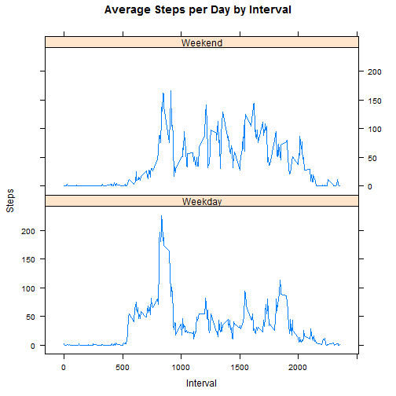

## Title Reproducible Reserach - Assignment: Course Project 1

###Introduction

This assignment is about using a large amount data of personal physical movement using activity monitoring devices such as a Fitbit, Nike Fuelband, or Jawbone Up. This device take measurements on selected volunteer regularly to improve their health, to find patterns in their behavior. The device will collects data at 5 minute intervals through out the day. The data consists of two months of data from an anonymous individual collected during the months of October and November, 2012 and include the number of steps taken in 5 minute intervals each day.


```r
library(lattice)
library(knitr)
setwd("C:\\Users\\Onwer\\Documents\\R")
```

```
## Error in setwd("C:\\Users\\Onwer\\Documents\\R"): cannot change working directory
```


## Loading and preprocessing the data

Data been download from http://d396qusza40orc.cloudfront.net/repdata%2Fdata%2Factivity.zip to r workspace folder
then load to variable input


```r
input <- read.csv("./repdata_data_activity/activity.csv")
```


## Answering question : What is mean total number of steps taken per day?
For this question, histrogram been created to display sum of steps per daye. Then compute mean and median.


```r
create_steps <- aggregate(steps ~ date, input, sum)
hist(create_steps$steps, main = paste("Total Steps Each Day"), col="green", xlab="Number of Steps")
```


Calculating mean

```r
cal_mean <- mean(create_steps$steps)
```
The mean of total number of steps per day is1.0766189 &times; 10<sup>4</sup>

calculating median

```r
cal_median <- median(create_steps$steps)
```

The median of total number of step per day is10765


## Answering question : What is the average daily activity pattern?

Create time series plot (i.e. type = "l") of the 5-minute interval (x-axis) and the average number of steps taken, averaged across all days (y-axis)

```r
cal_avg_interval <- aggregate(steps ~ interval, input, mean)
plot(cal_avg_interval$interval, cal_avg_interval$steps, type="l", xlab="Interval", ylab="Number of Steps",main="Average Number of Steps per Day by Interval")
```


```r
max_interval <- cal_avg_interval[which.max(cal_avg_interval$steps),1]
```

The 5-minute interval, on average across all the days in the data set, containing the maximum number of steps is 835.

## Answering Question : Impute missing values. Compare imputed to non-imputed data.

Calculate and report the total number of missing values in the dataset into variable impute


```r
inprogress <- sum(!complete.cases(input))

impute <- transform(input, steps = ifelse(is.na(input$steps), cal_avg_interval$steps[match(input$interval, cal_avg_interval$interval)], input$steps))
```

For first day of measurement (10-01-2012), value zero been replace. 


```r
impute[as.character(impute$date) == "2012-10-01", 1] <- 0
```

Recalculate total steps by day imputed and non imputed. Then crete comparison Histogram. 

```r
step_byday <- aggregate(steps ~ date, impute, sum)
hist(step_byday$steps, main = paste("Total Steps Each Day"), col="purple", xlab="Number of Steps")
 
hist(create_steps$steps, main = paste("Total Steps Each Day"), col="green", xlab="Number of Steps", add=T)
legend("topright", c("Imputed", "Non-imputed"), col=c("purple", "green"), lwd=10)
```


Calculate mean for imputed data. 

```r
mean_impute <- mean(step_byday$steps)
```

calculate median for imputed data

```r
median_impute <- median(step_byday$steps)
```


Calculate total difference.

```r
count_impact <- sum(step_byday$steps) - sum(create_steps$steps)
```
* The imputed data mean is 1.0589694 &times; 10<sup>4</sup>
* The imputed data median is 1.0766189 &times; 10<sup>4</sup>
* the impact of imputing missing data on the estimates of the total daily number of steps 7.5363321 &times; 10<sup>4</sup>
* when compare imputed data set of new mean is 1.0589694 &times; 10<sup>4</sup> and the new median is 1.0766189 &times; 10<sup>4</sup> with the    non imputed mean 1.0766189 &times; 10<sup>4</sup> and median 10765, it show the mean doesn't change and the median has a  
  slightly different. In fact, the new median becomes identical to the mean. From comparison, we can be conclude   the missing data for the intervals more identical to the means, and median is shifted and becomes identical to   the mean.
* The impact of imputing missing data on the estimates of the total daily number of steps is also clear and have   higher frquency counts in the histogram at the center region, in other word, close to the mean.


## Answering question : Are there differences in activity patterns between weekdays and weekends?

Create a new factor variable to compare and contrast number of steps between the week and weekend in the dataset. Then Generate plot containing a time series plot (i.e. type = "l") of the 5-minute interval (x-axis) and the average number of steps taken, averaged across all weekday days or weekend days (y-axis). 


```r
weekdays <- c("Monday", "Tuesday", "Wednesday", "Thursday", 
              "Friday")
impute$dow = as.factor(ifelse(is.element(weekdays(as.Date(impute$date)),weekdays), "Weekday", "Weekend"))

step_byday <- aggregate(steps ~ interval + dow, impute, mean)

pnow <- xyplot(step_byday$steps ~ step_byday$interval|step_byday$dow, main="Average Steps per Day by Interval",xlab="Interval", ylab="Steps",layout=c(1,2), type="l")
print(pnow)
```



